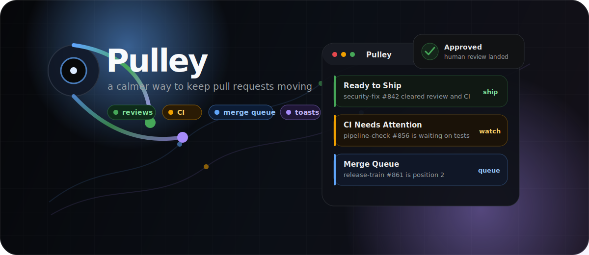

<p align="center">
  
</p>

<h1 align="center">Pulley</h1>

<p align="center">
  <strong>A quiet macOS menu bar app for pull requests that need your attention.</strong>
</p>

<p align="center">
  <a href="#install"></a>
  <a href="https://www.electronjs.org/"></a>
  <a href="https://cli.github.com/"></a>
  <a href="LICENSE"></a>
</p>

Pulley is a focused menu bar companion for engineers who live in pull requests but do not want to live in GitHub tabs. It lifts the signals that change what you should do next: human reviews, CI failures, pending checks, merge queue movement, review requests, and approvals.

It is intentionally quiet. Pulley does not turn every GitHub event into noise. It waits for momentum-changing moments, then gives you a small, useful signal.

```text
╭─────────────────────────────────────────────────────╮
│    File  Edit  View  Window              Pulley ◐  │
╰──────────────────────────────────────────┬──────────╯
                                           │
                            ╭──────────────────────────────╮
                            │ Pulley                   ● 3 │
                            ├──────────────────────────────┤
                            │ ✓ Ready to Ship      #842    │
                            │ ! CI Needs Attention #856    │
                            │ → Merge Queue        #861    │
                            ├──────────────────────────────┤
                            │ synced now        quiet mode │
                            ╰──────────────────────────────╯
```

## Why Pulley exists

Pull requests do not usually fail because you forgot how to merge. They stall because the next signal is buried: a stale review, a failing check, a queue position, a human approval, a requested change.

Pulley keeps those signals close without making them loud. The brand is the product promise: a small mechanism, a little mechanical advantage, and just enough motion to keep work moving.

## What it watches

| Signal | What Pulley shows |
| --- | --- |
| **Authored PRs** | Open pull requests you own, grouped by next action |
| **Human reviews** | Approvals, comments, and requested changes from real reviewers |
| **CI state** | Passing, pending, and failing checks |
| **Merge queue** | Queue entry and position when a PR is waiting to land |
| **Review requests** | PRs waiting on you |
| **Alert toasts** | Small desktop alerts when a PR changes state |

## The attention model

Pulley treats pull requests like a signal pipeline:

1. **Ready** — review is complete and CI is green.
2. **Blocked** — feedback or failing checks need attention.
3. **Waiting** — review or CI is still in motion.
4. **Queued** — the PR is in the merge queue and moving toward main.

The menu bar stays calm until one of those states changes.

## Install

Pulley currently runs from source.

```bash
git clone https://github.com/sophiagavrila/pulley.git
cd pulley
npm install
npm start
```

## Requirements

- macOS
- Node.js and npm
- GitHub CLI (`gh`) authenticated with access to the repositories you want to monitor

Pulley reads pull request data through your local `gh` CLI session. It does not store GitHub tokens in this repository.

## Launch at login

```bash
npm run install-autostart
```

Disable launch at login:

```bash
npm run uninstall-autostart
```

The autostart script generates a LaunchAgent plist locally at `~/Library/LaunchAgents/com.sophiagavrila.pulley.plist` using the current checkout path.

## Privacy

Pulley is local-first:

- It shells out to the GitHub CLI you already authenticated.
- It does not commit, embed, or ship tokens.
- It does not send PR data to a third-party service.
- Desktop alerts are generated locally by the Electron app.

## Development

```bash
npm install
npm start
```

Useful files:

| Path | Purpose |
| --- | --- |
| `main.js` | Electron, menu bar, refresh loop, and alert windows |
| `lib/fetch-prs.js` | GitHub CLI data collection and PR categorization |
| `renderer/` | Menu bar UI |
| `script/install-autostart.js` | LaunchAgent generation |

## Name

Pulley is named for the small mechanism that does quiet lifting. It does not replace GitHub; it gives your pull requests enough mechanical advantage to keep moving.
